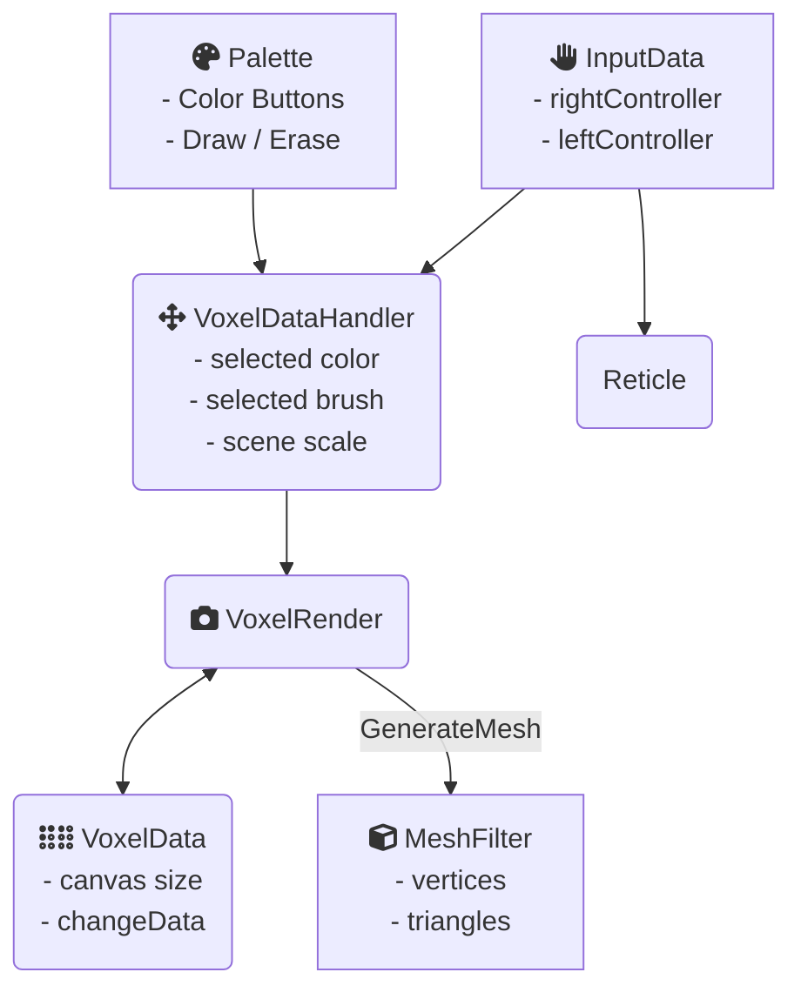

# Programátorská dokumentace programu VoxelSculpt

## 1. Nastavení prostředí Unity
Program je vytvořený ve verzi Unity 2020.3.25f1 a využívá pluginu OpenXR, který nově není potřeba nijak externě přidávat, pouze ho aktivovat v menu Unity. Pro spárování s headsetem stačí brýle připojit k počítači - celý program byl odladěn pouze na brýlích Valve Index, ale knihovna OpenXR zajišťuje vrstvu abstrakce, díky které by měl program běžet bez problémů i na ostatních zařízeních. 

## 2. **Ptačí pohled architektury projektu**

V každém momentu si objekt VoxelDataHandler ve své Update funkci kontroluje, zda bylo stisknuto tlačítko pomocí rozhraní InputData. Paralelně s tím si kontroluje Paleta jakožto GameObject připoutaný k GameObjectu levého ovladače zda neregistruje raycastovaný paprsek z pravého ovladače (pomocí scriptu Tracked Device Graphic Raycaster z knihovny OpenXR).

Program se podle situace rozvětví 
- Pokud uživatel interagoval s paletou, tak paleta změní property selectedColor a bool erasing na objektu voxelDataHandler. 
- Pokud uživatel zmáčknul trigger uvnitř vytyčeného kreslícího prostoru, umístí / odebere se kostička na tomto místě. VoxelDataHandler změní stav 3D arraye VoxelData, který v sobě uchovává který voxel má mít kterou barvu. Spolu s tím vyvolá rerender pomocí metody UpdateVoxelMesh ve třídě VoxelRender, která z arraye VoxelData sestaví mesh s využitím komponentu MeshFilter. Data ve VoxelData se přeloží do trojúhelníkové meshe s jednoduchou optimalizací nevytváření "vnitřních" polygonů. 

## 3. Výčet jednotlivých tříd a popis jejich funkcionality
## Reprezentace dat ve voxelové mřížce
### VoxelData
Nejdůležitější stav programu.
- **private int[,,] array data** - zde je držen momentální stav voxelové mřížky. Int *a* na pozici (x,y,z) indikuje, že se na tomto místě v mřížce vyskytuje kostička s texturou *a*. Barvy se později vykreslují podle globální UV textury, která v této verzi obsahuje pouze paletu barev, ale lze snadno upravit aby každý materiál reprezentoval obecnou texturu a ne jen jednolitou barvu. Hodnota 0 znamená globálně "absence kostičky".
- **public int GetNeighbour(int x, int y, int z, Direction dir)** - kontrola zda má kostička ve směru dir souseda - pro optimalizaci nevytváření zvenku neviditelných "mezistěn"
- **public void ChangeData(int x, int y, int z, int change)** - funkce pro změnu dat v (x,y,z)
## Dynamické vytváření meshe
### VoxelRender
Hlavní logika dynamického vytváření meshe na základě změn 
- **private void GenerateVoxelMesh(VoxelData data)** - funkce vytvářející korektně otexturovanou mesh z obsahu mřížky ve VoxelData. Volá si pomocnou funkci MakeCube, která dál volá MakeFace, které společně vytvoří příslušné vrcholy a triangly pro vytvoření meshe. 
- **public float scale** veřejná proměnná upravitelná z UI Unity - škála kostiček. 
- **public Vector3 realCoordsToGridCoords(Vector3 controllerPosition, Quaternion controllerRotation)** pomocná funkce pro převod reálných souřadnic na mřížkové.
### CubeMeshData
Pomocná třída s konstantami pro vytvoření polygonální meshe pro jednu krychli.

## Zpracování vstupu od uživatele
### InputData
Wrapper funkce pro správnou incializace VR vstupních zařízení (levého a pravého ovladače). Po inicializaci v sobě drží referenci na oba ovladače.

- **public InputDevice _rightController**
- **public InputDevice _leftController**
    
Podrobná dokumentace rozhraní InputDevice [zde](https://docs.unity3d.com/ScriptReference/XR.InputDevice.html)
### VoxelDataHandler
- **public int selectedMat** - ID vybraného materiálu.
- **public bool erasing** - True jestli mažeme, false jestli je vybraný štětec.
- **public void sculptIfPressed()** - Hlavní logika kreslení - pokud je zmáčknutý trigger (čteme z třídy InputData), tak se pokládá / maže blok na pozici v mřížce - ta se spočítá pomocí realCoordsToGridCoords a z pozice ovladače, kterou si voxelDataHandler přečte z InputData. 
- **public Vector3 adjustTipPosition(Vector3 controllerPosition, Quaternion controllerRotation)** - Funkce pro posunutí hlavičky štětce vůči ovladači - zde by šlo nastavit různé hodnoty pro různé ovladače, jelikož každý se drží v trochu rozdílném místě a v rozdílné rotaci.

### Palette
Paleta je sestavená z Unity UI komponentů, zjednodušeně je více "naklikaná" než napsaná. Obsahuje řádky tlačítek, kde každé registruje OnHover event a každé umí změnit parametr selectedMat u voxelDataHandleru v případě barevných tlačítek a bool erasing v případě tlačítek "draw" a "erase". 

### Reticle
Reticle je jednoduchý GameObject vycházející z primitivního objektu 3D krychle, který se skrze skript ReticleController.cs drží ve správné pozici v relaci k pravému ovladači, když jsme v módu kreslení. V módu výběru z palety se reticle neukazuje, aby uživatele nemátl.
